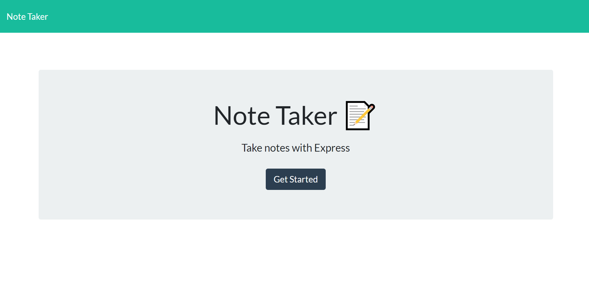
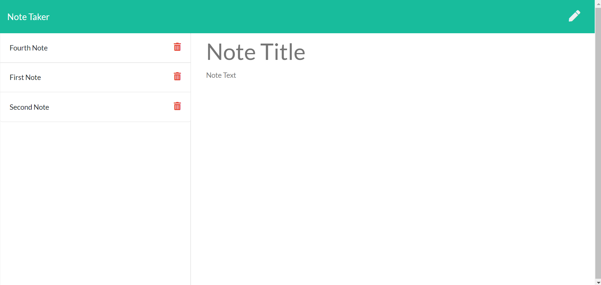

# note-taker

## Description

 The Note Taker application is an express backend application. The interface is very simple as it's primary purpose is to show the ability to connect the front end and the backend for an application to run properly.

 The application is deployed to Heroku via the link below:

 https://arcane-bastion-29067.herokuapp.com/

 When you first navigate to the page, you are taken to the main page that has the name of the application and has a button to get started with the notes. In the backend, the application uses the npm package express to handle the different routes.

 The first and primary route is the "/" route which takes you to the main page. After you click the get started button, the page takes you to the "/notes" route where you see any saved notes and can also add a new note.

 There are three other routes available on the page. The "/api/notes" route to get the date in JSON format. The post route to add a note to the JSON file and return the new list to the user. And the delete route to delete a note from the existing list.

 Below is a screenshot of the main page:

 

 Below is a screenshot of the notes page:

 

 ## Table of Contents

* [Installation](#installation)
* [Usage](#usage)
* [License](#license)
* [Contributing](#contributing)
* [Tests](#tests)
* [Questions](#questions)

## Installation

The application uses the express npm package. To install the package run npm install express on your computer's terminal.

## Usage

To use the application simply run it using node by typing node server.js on the terminal or navigate to the deployed page using the link above.

## License

[MIT](https://choosealicense.com/licenses/mit/)

## Contributing

Contributions are currently not accepted for this project.

## Tests

This application does not have any tests in the code.

## Questions

My GitHub username is: chavalk

Link: https://github.com/chavalk

If you have additional questions, feel free to reach me at chavalk@hotmail.com.